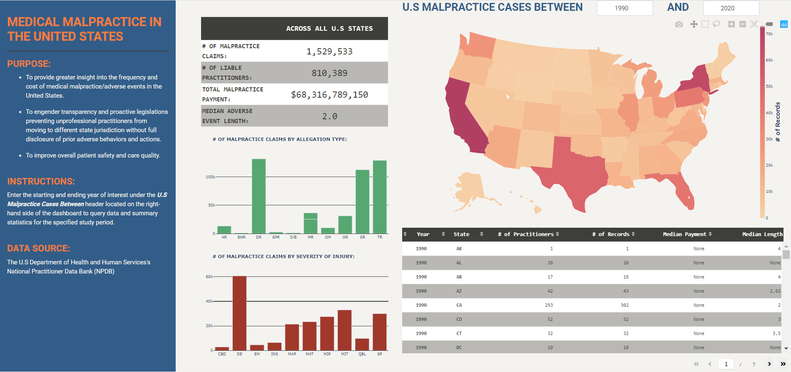

# U.S-Malpractice-Cases-Dashboard

<b>Overview of Project:</b>  
The goal of this project is to provide greater insight and transparency on the frequency and cost of malpractice cases in the United States
and to promote action towards better patient safety and care quality in U.S healthcare delivery. The dashboard showcases the number of malpractice cases across the United States with breakdown of summary statistics by each state, year, adverse action type, and severity of injury.

<b>Data Source:</b>  
U.S Department of Health and Human Services's National Practitioner Data Bank (https://www.npdb.hrsa.gov/)  
<i>Note: A copy of the input file used to generate the dashboard is available for download in the current repository as well. The raw data has been partitioned into 16 separate csv files labeled NPDB2004_1 to NPDB2004_16. Users should stack/combine the 16 csv files into a single file or dataset prior to running the Python code for the dashboard. In addition, documentation detailing variable definition for the data in the input file can also be found in the repository for users to reference.</i>

